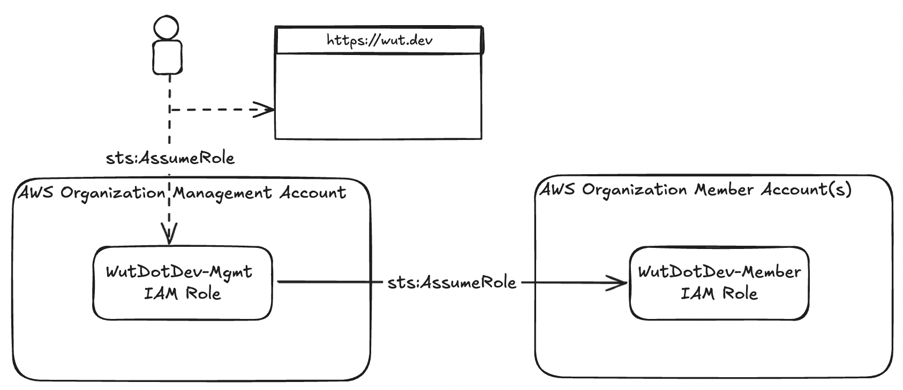

# Getting Started

## Requirements
Wut.Dev is a client-side application that works by using the AWS JavaScript SDK in your browser. As such, the primary requirement is that your load AWS credentials into memory that have access to make the AWS API requests necessary to enable wut.dev's features.

Some things you'll need:

1. A browser (preferably the latest version of Chrome)
2. An internet connection (to communicate with the AWS APIs)
3. AWS credentials with read-only "SecurityAudit" access to your AWS account(s)

## Access Patterns

Technically, Wut.Dev can work with any AWS account, but since many of its features are oriented around AWS Organizations, it's more useful to connect the management account. If you have multiple accounts, Wut.Dev can use the primary (or management) account's role to assume a role into each applicable member account.



Wut.Dev users (i.e. human engineers via an IAM entity) assume the `WutDotDev-Mgmt` role, passing the temporary credentials to Wut.Dev. The Wut.Dev application then transparently assumes the `WutDotDev-Member` role, in other accounts, when required.

## Wut.Dev Setup

There are several steps involved, which we'll walk through below:

1. Create an IAM role in the management account
2. Give it the necessary (limited, read-only) permissions (e.g., `organizations:Describe*`)
3. Configure the role's trust policy so that your engineers (Wut.Dev users) can use the role
4. Assume the role and load the temporary credentials in Wut.Dev
5. (Optionally) deploy roles in relevant member accounts for the management role to assume

We've created CloudFormation templates to help automate these steps, but manual steps are included below.

### Pre-Requisites

{: .note }
You must be able to log into your AWS Organization management account using an IAM principal that has permission to deploy CloudFormation templates and IAM roles. If you don't have this access, ask the team that manages your AWS environment.

## Via CloudFormation (Recommended)

We recommend using the Wut.Dev-provided CloudFormation templates, which will configure the correct roles, policies, and trust relationships for Wut.Dev to work properly and securely.

### 1. Deploy the Management Template

This step will create an IAM role in your management account, called `WutDotDev-Mgmt` and give it the permissions necessary to assume _other_ Wut.Dev roles deployed in your member accounts, as well as call read-only `organizations` APIs.

1. Click the link below to open the CloudFormation Stack creation wizard
1. The following parameters are required:
    1. `AssumeRolePrincipalArn` - the `WutDotDev-Mgmt` role needs to be assumed by (human) engineers in your organization. Because every company manages AWS access differently, we can't pre-populate this for you. You should set this to the role name associated with human engineers that you want to grant access to Wut.Dev. You can use wildcards if engineers in multiple accounts should be granted access. Example: `arn:aws:iam::*:role/engineers`. **Security Note**: the template already includes a condition statement that limits assume role access to entities in your organization only (see the next parameter).
    1. `OrganizationUnitId` - The trust policy for the `WutDotDev-Mgmt` is configured to only trust IAM entities that match the pattern defined in `AssumeRolePrincipalArn`. Because this can include wildcards, the `OrganizationUnitId` is used to provide an added layer of security.
    1. `IncludeSecurityAudit` - Whether the `SecurityAudit` policy should be attached to the `WutDotDev-Mgmt` role. This is useful if you're debugging access issues _in the management account_ but otherwise can be skipped if you're only debugging member accounts.

[Create CloudFormation Stack](https://console.aws.amazon.com/cloudformation/home?region=us-east-1#/stacks/quickcreate?templateURL=https://wut-dev-templates.s3.amazonaws.com/cfn-wut-dot-dev-mgmt-role.json&stackName=WutDotDev-Mgmt&param_AssumeRolePrincipalArn=replace-me&param_OrganizationUnitId=replace-me){: .btn .btn-purple }

### 2. Use the Role

When you're done, the IAM entities defined in `AssumeRolePrincipalArn` can now assume and use this role in Wut.Dev by running:

```bash
aws sts assume-role --role-arn arn:aws:iam::{AccountId}:role/WutDotDev-Mgmt --role-session-name WutDotDev
```

The access key ID, secret ID, and session token can then be copied into Wut.Dev.

{: .note }
You'll need to provide the above command/instructions to your engineers to whom you want to grant access to the Wut.Dev interface. We recommend creating an alias, like `wut` on the CLI to do so.

### 3. Deploy the Member Templates

{: .note }
If you haven't used CloudFormation StackSets in your Organization you may need to [configure the initial access](https://docs.aws.amazon.com/organizations/latest/userguide/services-that-can-integrate-cloudformation.html).

This step will create an IAM role in each of your member accounts, called `WutDotDev-Member` and give it the permissions necessary to call read-only APIs required for debugging and policy management (using the `SecurityAudit` policy). Its trust relationship will be configured to trust the `WutDotDev-Mgmt` role we created above.

1. Open the [CloudFormation StackSet creation wizard](https://console.aws.amazon.com/cloudformation/home?#/stacksets/create)
1. Use the following options:
    1. **Permissions**: Service-managed permissions
    1. **Prerequisite - Prepare template**: Template is ready
    1. **Specify template**: Amazon S3 URL
        1. Paste the following URL: `https://wut-dev-templates.s3.amazonaws.com/cfn-wut-dot-dev-member-role.json`
    1. **StackSet name**: `WutDotDev-Members`
    1. **StackSet description**: `Member account access for Wut.Dev`
    1. **Parameters: OrganizationMgmtAccountId**: Enter the AWS account ID of your AWS Organization management account
    1. **Execution configuration**: Inactive
    1. **Add stacks to stack set**: Deploy new stacks
    1. **Deployment targets**: Deploy to organization
        1. Note: If you prefer to only enable Wut.Dev on certain OUs, you can specify those here instead
    1. **Auto-deployment options**:
        1. **Automatic deployment**: Activated
        1. **Account removal behavior**: Delete stacks
    1. **Specify regions**: `us-east-1` (or your choice; only specify a single region)
    1. **Deployment options**
        1. **Maximum concurrent accounts - optional**: 1
        1. **Failure tolerance - optional**: 0
        1. **Region concurrency**: Sequential
        1. **Concurrency mode**: Strict failure tolerance
1. Review and deploy the template


## Manual Setup (Not Recommended)

### 1. Create the Wut.Dev IAM Role

In this step, we'll create an IAM role, called `WutDotDev-Mgmt` in your AWS Organization management account.

1. Create a new IAM role, called `WutDotDev-Mgmt`

### 2. Assign Limited Read-Only Permissions

In this step, we'll assign the role a limited set of IAM permissions that grant it read-only access to access metadata about your Organization and accounts.

1. Attach two managed policies:
    1. `AWSOrganizationsReadOnlyAccess`
    1. `SecurityAudit`
1. Attach an inline policy with the following content (this allows the role to assume the `Wut` role in member accounts):
    ```
    {
      "Version": "2012-10-17",
      "Statement": [
        {
          "Action": "sts:AssumeRole",
          "Resource": "arn:aws:iam::*:role/WutDotDevAccessRole",
          "Effect": "Allow"
        }
      ]
    }
    ```

### 3. Configure the Role Trust Policy

In this step, we'll update the role's trust policy so that your engineers can assume, and use, the role via the Wut.Dev application.

1. Attach the following trust relationship to the role, replacing `{YOUR ORG HERE}` and `{YOUR ROLE HERE}`:
    ```
    {
      "Version": "2012-10-17",
      "Statement": [
          {
              "Effect": "Allow",
              "Principal": {
                  "AWS": "*"
              },
              "Action": "sts:AssumeRole",
              "Condition": {
                  "StringEquals": {
                      "aws:PrincipalOrgID": "{YOUR ORG HERE}"
                  },
                  "StringLike": {
                      "aws:PrincipalArn": "arn:aws:iam::*:role/{YOUR ROLE HERE}"
                  }
              }
          }
      ]
    }
    ```

### 4. Use the Role

In this step, we'll use the STS "Assume Role" capability to obtain the temporary IAM permissions for use in Wut.Dev.

```bash
aws sts assume-role --role-arn arn:aws:iam::{AccountId}:role/WutDotDev-Mgmt --role-session-name WutDotDev
```

The access key ID, secret ID, and session token can then be copied into Wut.Dev.

{: .note }
You'll need to provide the above command/instructions to your engineers to whom you want to grant access to the Wut.Dev interface. We recommend creating an alias, like `wut` on the CLI to do so.

### 5. Deploy the Member Account Roles

In this (optional) step, we'll deploy an IAM role, called `WutDotDev-Member` to member accounts in your Organization. The `WutDotDev-Mgmt` role can assume this role, which will be used for debugging policies and access issues spanning multiple accounts.

{: .warning }
We strongly recommend using CloudFormation StackSets for this step; creating an IAM role in every member account can be very tedious.

1. Log into each member account using an entity that has permission to create and manage IAM roles.
1. Create an IAM role, called `WutDotDev-Member`
1. Attach the `SecurityAudit` managed IAM policy
1. Assign the following trust policy, replacing `{AWS MGMT ACCOUNT}` with the account ID of your AWS Organization management account
    ```
    {
      "Version": "2012-10-17",
      "Statement": [
          {
              "Effect": "Allow",
              "Principal": {
                  "AWS": "arn:aws:iam::{AWS MGMT ACCOUNT}:role/WutDotDev-Mgmt"
              },
              "Action": "sts:AssumeRole"
          }
      ]
    }
    ```