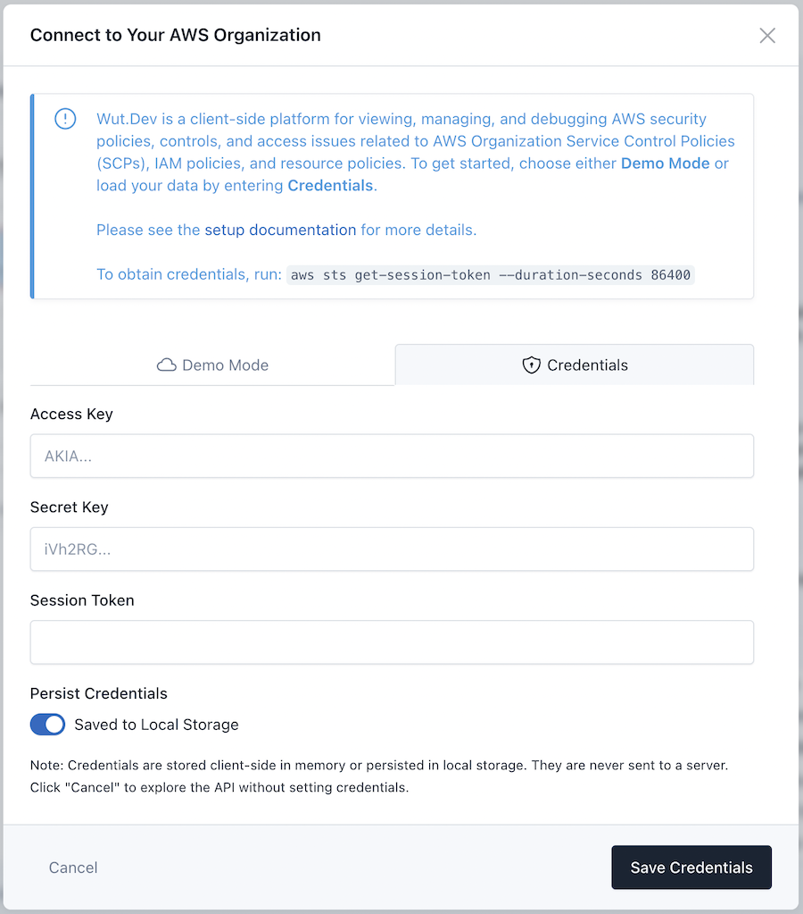

# Authenticating

Once you have [configured Wut.Dev](/getting_started), engineers can authenticate their browser session by assuming the `WutDotDev-Mgmt` role (replace the `AccountId` with that of your AWS Organizations management account):

```
$ aws sts assume-role --role-arn arn:aws:iam::{AccountId}:role/WutDotDev-Mgmt --role-session-name WutDotDev --output json

{
    "Credentials": {
        "AccessKeyId": "ASIAABCDEF1234567891",
        "SecretAccessKey": "abcdefg/T77rYPucfjTooSuE3nS0vHsy2u6N27lQ",
        "SessionToken": "IQabcdefG2luX2VjEHQaCXVzLWVhc3QtMSJGMEQCIDnmHSXr3ljZIdThy13jkD15+SUJCTX68LuI/Unr6BocAiA6qA6G+xP+cef39D6rtrBamaxhq+9JeaVHsAD9LtnLJCqWAghdEAAaDDM5MDI0OTQzNTI2OCIMStA7PY5MDHda+rXTKvMB/mMckFiXXURNzoS7RmGXZ8Yc64NQ2MfGIZLJlAEqOgKupW8MY+RdtQMC1sOV9iDev+oa5vxmIBC6/7MxTzDZSpfUxBRVaLzfmEerCCF/wTPZWW9lxSqkcd5guy3hjEeTt68hbTHGfvzHVomtTT5mJ+T5l+KpbmfUyDRkjH/eyctP+51V8Q30HG3sPzubiCGXkfJOojvpwlWDUGJv5fpaBFeRxAKR/sET55z6nbln8A3ZJH7Z2GrwRqnZWy2rn2oxsHLwq86WeFII1q4yG/FZDNdQ/KXrVmUlL1PCtuJ8iNcgpE1YIDYAW3kLTrMofxF0O+ZZMOrBqLUGOp4BAAh7sYFr3jsNZLioXahQLeHUBMDB0vZwFvesPRI41G4I9DHpLmBEdhRJiLQV+l+tenK2pR9clJEoODjv81DL9RyHEExK8s+8m6dVyke/YQpUFYp5BlZs31zgP518zHs4jKb8WNuuFEeWUA7Fmzp61FRBnMN45tTeMrfBVWduRl3umtZQbCxRC5aI3A4jS5PPZPJA+PCGSlw/EUGhKCk=",
        "Expiration": "2024-07-31T12:32:58+00:00"
    },
    "AssumedRoleUser": {
        "AssumedRoleId": "AROAABCDEF1234567891:WutDotDev",
        "Arn": "arn:aws:sts::123456789101:assumed-role/WutDotDev-Mgmt/WutDotDev"
    }
}
```

For added security, you can pass a session policy ensuring the credentials can only be used from your IP address:
```
aws sts assume-role --role-arn arn:aws:iam::${AccountId}:role/WutDotDev-Mgmt --role-session-name WutDotDev --output json --policy '{"Version": "2012-10-17","Statement": {"Effect": "Allow","Action": "*","Resource": "*","Condition": {"IpAddress": {"aws:SourceIp": "'$(curl -s http://checkip.amazonaws.com)'"}}}}'
```

Copy the `AccessKeyId`, `SecretAccessKey`, and `SessionToken` into Wut.Dev's "Manage Connection" UI:



## Troubleshooting
