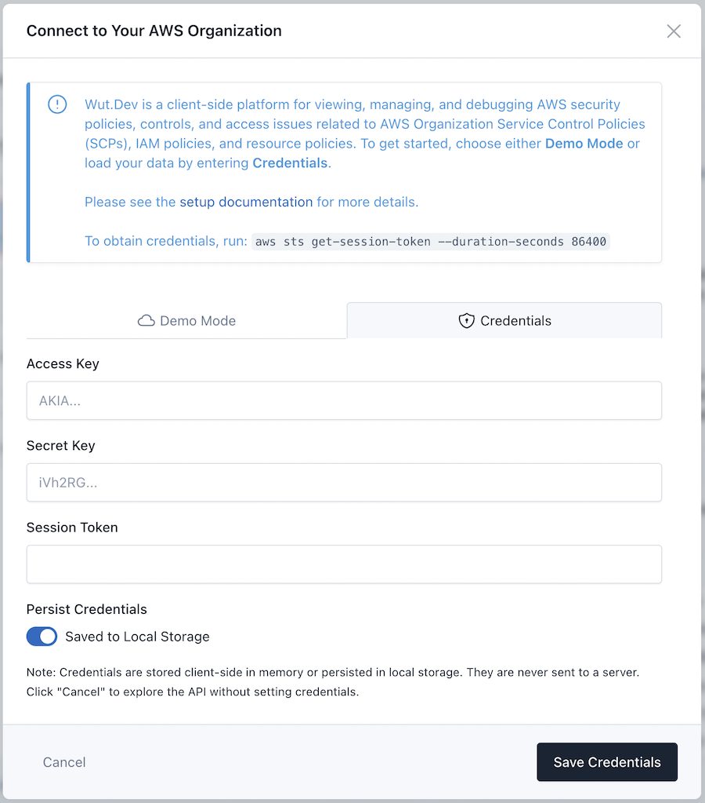

# Standalone Mode

Many of Wut.Dev's features can be used by simply using your own credentials in a single AWS account. This is the quickest way to try out Wut.Dev without setting up roles and cross-account access in your AWS Organization.

{: .warning }
For cross-account, and Organization-related features, Wut.Dev will attempt to perform an "assume role" on a Wut.Dev-named role in the target account. These features will not work in standalone mode.

## Generate a Session

In this step, we'll generate a temporary AWS IAM session using your local credentials. This session will be limited in duration (see below for why).

{: .note }
This session will inherit whatever policies your local user has. If you don't have access to the APIs Wut.Dev uses, then you will see `AccessDenied` errors in the UI.

```bash
aws sts get-session-token --duration-seconds 900
```

You'll see an output like the following:

```json
{
    "Credentials": {
        "AccessKeyId": "ASIAABCDEF1234567891",
        "SecretAccessKey": "abcdefg/T77rYPucfjTooSuE3nS0vHsy2u6N27lQ",
        "SessionToken": "IQabcdefG2luX2VjEHQaCXVzLWVhc3QtMSJGMEQCIDnmHSXr3ljZIdThy13jkD15+SUJCTX68LuI/Unr6BocAiA6qA6G+xP+cef39D6rtrBamaxhq+9JeaVHsAD9LtnLJCqWAghdEAAaDDM5MDI0OTQzNTI2OCIMStA7PY5MDHda+rXTKvMB/mMckFiXXURNzoS7RmGXZ8Yc64NQ2MfGIZLJlAEqOgKupW8MY+RdtQMC1sOV9iDev+oa5vxmIBC6/7MxTzDZSpfUxBRVaLzfmEerCCF/wTPZWW9lxSqkcd5guy3hjEeTt68hbTHGfvzHVomtTT5mJ+T5l+KpbmfUyDRkjH/eyctP+51V8Q30HG3sPzubiCGXkfJOojvpwlWDUGJv5fpaBFeRxAKR/sET55z6nbln8A3ZJH7Z2GrwRqnZWy2rn2oxsHLwq86WeFII1q4yG/FZDNdQ/KXrVmUlL1PCtuJ8iNcgpE1YIDYAW3kLTrMofxF0O+ZZMOrBqLUGOp4BAAh7sYFr3jsNZLioXahQLeHUBMDB0vZwFvesPRI41G4I9DHpLmBEdhRJiLQV+l+tenK2pR9clJEoODjv81DL9RyHEExK8s+8m6dVyke/YQpUFYp5BlZs31zgP518zHs4jKb8WNuuFEeWUA7Fmzp61FRBnMN45tTeMrfBVWduRl3umtZQbCxRC5aI3A4jS5PPZPJA+PCGSlw/EUGhKCk=",
        "Expiration": "2024-07-31T12:32:58+00:00"
    }
}
```

Copy the `AccessKeyId`, `SecretAccessKey`, and `SessionToken` into Wut.Dev's "Manage Connection" UI:



## FAQ

### Why is the session duration short? Is this necessary?
It's not necessary, but it's an additional step that helps guarantee that, even if Wut.Dev were compromised, or for some reason your browser, plugins, or malware on your laptop were used to steal the credentials used in Wut.Dev, they could not be used elsewhere after the stated duration.

### What are my credentials used for?
Credentials are soley used to sign AWS API requests made from your browser directly to the AWS API. Wut.Dev does not upload, inspect, or send your credentials anywhere; Wut.Dev is a 100% client-side application. For more details, see [Security](/security.html).